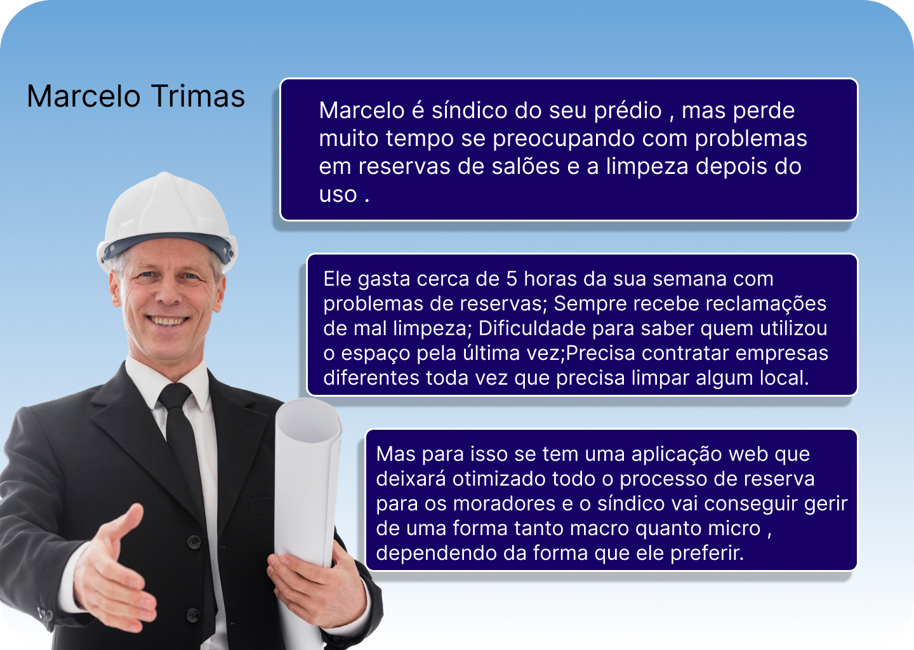

# Web Application Document - Projeto Individual - Módulo 2 - Inteli

**_Os trechos em itálico servem apenas como guia para o preenchimento da seção. Por esse motivo, não devem fazer parte da documentação final._**

## Nome do Projeto

#### Autor do projeto

## Sumário

1. [Introdução](#c1)
2. [Visão Geral da Aplicação Web](#c2)
3. [Projeto Técnico da Aplicação Web](#c3)
4. [Desenvolvimento da Aplicação Web](#c4)
5. [Referências](#c5)

<br>

## <a name="c1"></a>1. Introdução (Semana 01)

Oferecer uma plataforma digital para moradores reservarem espaços comuns (como salões de festa e churrasqueiras), gerenciarem eventos, e automaticamente acionarem o agendamento de limpeza após o uso, otimizando o trabalho do síndico e do prestador de serviços.

---

## <a name="c2"></a>2. Visão Geral da Aplicação Web

### 2.1. Personas (Semana 01)

<div align="center">
    <small><strong style="font-size: 12px;">Persona;</strong></small><br>
      
    <small style="margin-top: 4px; font-size: 10px;">Fonte: Material produzido pelos autores (2025)</small>
</div>
### 2.2. User Stories (Semana 01)

US01 | Como síndico do predio, quero poder ter acesso apenas do sistems para ter certeza que ele vai está funcionando, para que eu não precise intermediar a reserva do morador para o salão nem a chamada da limpeza.

US02 | Como morador do predio, quero apenas reservar pelo meu celular o salão de festas e não ter que me preocupar com limpeza, para não reclamarem que eu estou limpando mal e para nao ter dor de cabeça no dia seguinte com limpeza.

US03 | Como propríetaria de uma empresa de limpeza, quero agilizar processos de interações com síndicos e moradores dos predios, para que o meu serviço seja apenaws de limpeza e não de tirar dúvidas do cliente.

I | o síndico só precisa acessar o sistema; não depende diretamente de outra funcionalidade.
N | o que exatamente o síndico vê? Dashboard? Notificações? Fluxo aberto para discussão.
V | facilita a vida do síndico e reduz trabalho manual, que é o objetivo.
E | criar uma tela de acesso e checagem de sistema é algo bem claro e específico.
S | a descrição é um pouco mais longa pelo fato de ter dois processos diferentes 1- Acesso ao sistema e 2- Acompanhamento de reservas e limpeza.
T | dá para criar um teste para verificar se o síndico consegue acessar e acompanhar as reservas sem necessidade de intervenção humana.

## <a name="c3"></a>3. Projeto da Aplicação Web

### 3.1. Modelagem do banco de dados (Semana 3)

<div align="center">
    <small><strong style="font-size: 12px;">banco de dados(Figura 1);</strong></small><br>
      
    <small style="margin-top: 4px; font-size: 10px;">Fonte: Material produzido pelos autores (2025)</small>
</div>*Posicione também o modelo físico com o Schema do BD (arquivo .sql)*

<a href="/scripts/Untitled.sql" aqui</a> para ir para o modelo físico com o Schema do BD (arquivo .sql)

### 3.1.1 BD e Models (Semana 5)

_Descreva aqui os Models implementados no sistema web_

### 3.2. Arquitetura (Semana 5)

_Posicione aqui o diagrama de arquitetura da sua solução de aplicação web. Atualize sempre que necessário._

**Instruções para criação do diagrama de arquitetura**

- **Model**: A camada que lida com a lógica de negócios e interage com o banco de dados.
- **View**: A camada responsável pela interface de usuário.
- **Controller**: A camada que recebe as requisições, processa as ações e atualiza o modelo e a visualização.

| Tabela        | Campos principais                                             | Descrição breve                         |
| ------------- | ------------------------------------------------------------- | --------------------------------------- |
| `player`      | id, username, email, phone, password                          | Moradores que fazem reservas            |
| `reservation` | id, user_id, space_id, date, initial_hour, final_hour, status | Reservas feitas pelos moradores         |
| `spaces`      | id, name, type, capacity, location                            | Espaços disponíveis para reserva        |
| `cleaning`    | id, reservation_id, employee_id, cleaning_date, status        | Controle de limpeza após o uso          |
| `employees`   | id, name, role, phone, email                                  | Funcionários como síndico, zelador etc. |

### 3.3. Wireframes (Semana 03)

<div align="center">
    <small><strong style="font-size: 12px;">banco de dados(Figura 1);</strong></small><br>
      
    <small style="margin-top: 4px; font-size: 10px;">Fonte: Material produzido pelos autores (2025)</small>
</div>
### 3.4. Guia de estilos (Semana 05)

_Descreva aqui orientações gerais para o leitor sobre como utilizar os componentes do guia de estilos de sua solução._

### 3.5. Protótipo de alta fidelidade (Semana 05)

<div align="center">
    <small><strong style="font-size: 12px;">prótotipo</strong></small><br>
      
    <small style="margin-top: 4px; font-size: 10px;">Fonte: Material produzido pelos autores (2025)</small>
</div>
<div align="center">
    <small><strong style="font-size: 12px;">prótotipo</strong></small><br>
      
    <small style="margin-top: 4px; font-size: 10px;">Fonte: Material produzido pelos autores (2025)</small>
</div>
<div align="center">
    <small><strong style="font-size: 12px;">prótotipo</strong></small><br>
      
    <small style="margin-top: 4px; font-size: 10px;">Fonte: Material produzido pelos autores (2025)</small>
</div>
<div align="center">
    <small><strong style="font-size: 12px;">prótotipo</strong></small><br>
      
    <small style="margin-top: 4px; font-size: 10px;">Fonte: Material produzido pelos autores (2025)</small>
</div>
<div align="center">
    <small><strong style="font-size: 12px;">prótotipo</strong></small><br>
      
    <small style="margin-top: 4px; font-size: 10px;">Fonte: Material produzido pelos autores (2025)</small>
</div>
<div align="center">
    <small><strong style="font-size: 12px;">prótotipo</strong></small><br>
      
    <small style="margin-top: 4px; font-size: 10px;">Fonte: Material produzido pelos autores (2025)</small>
</div>
<div align="center">
    <small><strong style="font-size: 12px;">prótotipo</strong></small><br>
      
    <small style="margin-top: 4px; font-size: 10px;">Fonte: Material produzido pelos autores (2025)</small>
</div>
<div align="center">
    <small><strong style="font-size: 12px;">prótotipo</strong></small><br>
      
    <small style="margin-top: 4px; font-size: 10px;">Fonte: Material produzido pelos autores (2025)</small>
</div>
<div align="center">
    <small><strong style="font-size: 12px;">prótotipo</strong></small><br>
      
    <small style="margin-top: 4px; font-size: 10px;">Fonte: Material produzido pelos autores (2025)</small>
</div>
<div align="center">
    <small><strong style="font-size: 12px;">prótotipo</strong></small><br>
      
    <small style="margin-top: 4px; font-size: 10px;">Fonte: Material produzido pelos autores (2025)</small>
</div>
<div align="center">
    <small><strong style="font-size: 12px;">prótotipo</strong></small><br>
      
    <small style="margin-top: 4px; font-size: 10px;">Fonte: Material produzido pelos autores (2025)</small>
</div>
<div align="center">
    <small><strong style="font-size: 12px;">prótotipo</strong></small><br>
      
    <small style="margin-top: 4px; font-size: 10px;">Fonte: Material produzido pelos autores (2025)</small>
</div>
<div align="center">
    <small><strong style="font-size: 12px;">prótotipo</strong></small><br>
      
    <small style="margin-top: 4px; font-size: 10px;">Fonte: Material produzido pelos autores (2025)</small>
</div>
<div align="center">
    <small><strong style="font-size: 12px;">prótotipo</strong></small><br>
      
    <small style="margin-top: 4px; font-size: 10px;">Fonte: Material produzido pelos autores (2025)</small>
</div>
<div align="center">
    <small><strong style="font-size: 12px;">prótotipo</strong></small><br>
      
    <small style="margin-top: 4px; font-size: 10px;">Fonte: Material produzido pelos autores (2025)</small>
</div>
<div align="center">
    <small><strong style="font-size: 12px;">prótotipo</strong></small><br>
      
    <small style="margin-top: 4px; font-size: 10px;">Fonte: Material produzido pelos autores (2025)</small>
</div>
<div align="center">
    <small><strong style="font-size: 12px;">prótotipo</strong></small><br>
      
    <small style="margin-top: 4px; font-size: 10px;">Fonte: Material produzido pelos autores (2025)</small>
</div>
<div align="center">
    <small><strong style="font-size: 12px;">prótotipo</strong></small><br>
      
    <small style="margin-top: 4px; font-size: 10px;">Fonte: Material produzido pelos autores (2025)</small>
</div>
<div align="center">
    <small><strong style="font-size: 12px;">Tipográfia</strong></small><br>
      
    <small style="margin-top: 4px; font-size: 10px;">Fonte: Material produzido pelos autores (2025)</small>
</div>
### 3.6. WebAPI e endpoints (Semana 05)

Esta seção documenta todos os endpoints da API REST do sistema de reserva de espaços comuns. A API segue os padrões REST e utiliza JSON para comunicação.

#### Informações Gerais da API

- **URL Base**: `http://localhost:3000/api`
- **Formato de Dados**: JSON
- **Autenticação**: Não implementada (desenvolvimento)
- **Códigos de Status HTTP**:
  - `200`: Sucesso
  - `201`: Criado com sucesso
  - `404`: Recurso não encontrado
  - `500`: Erro interno do servidor

---

#### 3.6.1. Endpoints de Usuários (Moradores)

**GET /api/users**

- **Descrição**: Busca todos os usuários/moradores cadastrados
- **Método**: GET
- **Parâmetros**: Nenhum
- **Resposta de Sucesso (200)**:

```json
[
  {
    "id": 1,
    "username": "admin",
    "email": "admin@admin.com",
    "phone": "123456789",
    "password": "123456"
  }
]
```

**GET /api/users/:id**

- **Descrição**: Busca um usuário específico pelo ID
- **Método**: GET
- **Parâmetros de URL**: `id` (integer) - ID do usuário
- **Resposta de Sucesso (200)**:

```json
{
  "id": 1,
  "username": "admin",
  "email": "admin@admin.com",
  "phone": "123456789",
  "password": "123456"
}
```

- **Resposta de Erro (404)**: `{ "error": "Player not found" }`

**POST /api/users**

- **Descrição**: Cria um novo usuário/morador
- **Método**: POST
- **Corpo da Requisição**:

```json
{
  "username": "novo_usuario",
  "email": "usuario@email.com",
  "phone": "987654321",
  "password": "senha123"
}
```

- **Resposta de Sucesso (201)**:

```json
{
  "id": 5,
  "username": "novo_usuario",
  "email": "usuario@email.com",
  "phone": "987654321",
  "password": "senha123"
}
```

**PUT /api/users/:id**

- **Descrição**: Atualiza os dados de um usuário existente
- **Método**: PUT
- **Parâmetros de URL**: `id` (integer) - ID do usuário
- **Corpo da Requisição**:

```json
{
  "username": "usuario_atualizado",
  "email": "novo_email@email.com",
  "phone": "111222333",
  "password": "nova_senha"
}
```

- **Resposta de Sucesso (200)**: Objeto do usuário atualizado
- **Resposta de Erro (404)**: `{ "error": "Player not found" }`

**DELETE /api/users/:id**

- **Descrição**: Remove um usuário do sistema
- **Método**: DELETE
- **Parâmetros de URL**: `id` (integer) - ID do usuário
- **Resposta de Sucesso (200)**: Objeto do usuário removido
- **Resposta de Erro (404)**: `{ "error": "Player not found" }`

---

#### 3.6.2. Endpoints de Espaços

**GET /api/spaces**

- **Descrição**: Lista todos os espaços disponíveis para reserva
- **Método**: GET
- **Parâmetros**: Nenhum
- **Resposta de Sucesso (200)**:

```json
[
  {
    "id": 1,
    "name": "Sala de Reuniões A",
    "type": "Reunião",
    "capacity": 10,
    "location": "Andar 1"
  }
]
```

**GET /api/spaces/:id**

- **Descrição**: Busca informações de um espaço específico
- **Método**: GET
- **Parâmetros de URL**: `id` (integer) - ID do espaço
- **Resposta de Sucesso (200)**:

```json
{
  "id": 1,
  "name": "Sala de Reuniões A",
  "type": "Reunião",
  "capacity": 10,
  "location": "Andar 1"
}
```

- **Resposta de Erro (404)**: `{ "error": "Space not found" }`

**POST /api/spaces**

- **Descrição**: Cadastra um novo espaço no sistema
- **Método**: POST
- **Corpo da Requisição**:

```json
{
  "name": "Nova Sala",
  "type": "Evento",
  "capacity": 50,
  "location": "Andar 3"
}
```

- **Resposta de Sucesso (201)**: Objeto do espaço criado

**PUT /api/spaces/:id**

- **Descrição**: Atualiza informações de um espaço existente
- **Método**: PUT
- **Parâmetros de URL**: `id` (integer) - ID do espaço
- **Corpo da Requisição**:

```json
{
  "name": "Sala Atualizada",
  "type": "Trabalho",
  "capacity": 25,
  "location": "Andar 2"
}
```

- **Resposta de Sucesso (200)**: Objeto do espaço atualizado
- **Resposta de Erro (404)**: `{ "error": "Space not found" }`

**DELETE /api/spaces/:id**

- **Descrição**: Remove um espaço do sistema
- **Método**: DELETE
- **Parâmetros de URL**: `id` (integer) - ID do espaço
- **Resposta de Sucesso (200)**: Objeto do espaço removido
- **Resposta de Erro (404)**: `{ "error": "Space not found" }`

---

#### 3.6.3. Endpoints de Reservas

**GET /api/reservations**

- **Descrição**: Lista todas as reservas do sistema
- **Método**: GET
- **Parâmetros**: Nenhum
- **Resposta de Sucesso (200)**:

```json
[
  {
    "id": 1,
    "user_id": 1,
    "space_id": 1,
    "reservation_date": "2025-01-15",
    "initial_hour": "2025-01-15T14:00:00.000Z",
    "final_hour": "2025-01-15T18:00:00.000Z",
    "status": "confirmed"
  }
]
```

**GET /api/reservations/:id**

- **Descrição**: Busca uma reserva específica pelo ID
- **Método**: GET
- **Parâmetros de URL**: `id` (integer) - ID da reserva
- **Resposta de Sucesso (200)**:

```json
{
  "id": 1,
  "user_id": 1,
  "space_id": 1,
  "reservation_date": "2025-01-15",
  "initial_hour": "2025-01-15T14:00:00.000Z",
  "final_hour": "2025-01-15T18:00:00.000Z",
  "status": "confirmed"
}
```

- **Resposta de Erro (404)**: `{ "error": "Reservation not found" }`

**POST /api/reservations**

- **Descrição**: Cria uma nova reserva de espaço
- **Método**: POST
- **Corpo da Requisição**:

```json
{
  "user_id": 1,
  "space_id": 1,
  "reservation_date": "2025-01-20",
  "initial_hour": "2025-01-20T10:00:00.000Z",
  "final_hour": "2025-01-20T14:00:00.000Z",
  "status": "pending"
}
```

- **Resposta de Sucesso (201)**: Objeto da reserva criada

**PUT /api/reservations/:id**

- **Descrição**: Atualiza uma reserva existente
- **Método**: PUT
- **Parâmetros de URL**: `id` (integer) - ID da reserva
- **Corpo da Requisição**:

```json
{
  "user_id": 1,
  "space_id": 2,
  "reservation_date": "2025-01-21",
  "initial_hour": "2025-01-21T15:00:00.000Z",
  "final_hour": "2025-01-21T19:00:00.000Z",
  "status": "confirmed"
}
```

- **Resposta de Sucesso (200)**: Objeto da reserva atualizada
- **Resposta de Erro (404)**: `{ "error": "Reservation not found" }`

**DELETE /api/reservations/:id**

- **Descrição**: Cancela/remove uma reserva
- **Método**: DELETE
- **Parâmetros de URL**: `id` (integer) - ID da reserva
- **Resposta de Sucesso (200)**: Objeto da reserva removida
- **Resposta de Erro (404)**: `{ "error": "Reservation not found" }`

---

#### 3.6.4. Endpoints de Limpeza

**GET /api/cleaning**

- **Descrição**: Lista todos os agendamentos de limpeza
- **Método**: GET
- **Parâmetros**: Nenhum
- **Resposta de Sucesso (200)**:

```json
[
  {
    "id": 1,
    "reservation_id": 1,
    "space_id": 1,
    "employee_id": 1,
    "cleaning_date": "2025-01-16",
    "status": "completed"
  }
]
```

**GET /api/cleaning/:id**

- **Descrição**: Busca um agendamento de limpeza específico
- **Método**: GET
- **Parâmetros de URL**: `id` (integer) - ID do agendamento
- **Resposta de Sucesso (200)**:

```json
{
  "id": 1,
  "reservation_id": 1,
  "space_id": 1,
  "employee_id": 1,
  "cleaning_date": "2025-01-16",
  "status": "completed"
}
```

- **Resposta de Erro (404)**: `{ "error": "Cleaning not found" }`

**POST /api/cleaning**

- **Descrição**: Agenda uma nova limpeza
- **Método**: POST
- **Corpo da Requisição**:

```json
{
  "reservation_id": 2,
  "space_id": 2,
  "employee_id": 1,
  "cleaning_date": "2025-01-22",
  "status": "pending"
}
```

- **Resposta de Sucesso (201)**: Objeto do agendamento criado

**PUT /api/cleaning/:id**

- **Descrição**: Atualiza um agendamento de limpeza
- **Método**: PUT
- **Parâmetros de URL**: `id` (integer) - ID do agendamento
- **Corpo da Requisição**:

```json
{
  "reservation_id": 2,
  "space_id": 2,
  "employee_id": 2,
  "cleaning_date": "2025-01-23",
  "status": "in_progress"
}
```

- **Resposta de Sucesso (200)**: Objeto do agendamento atualizado
- **Resposta de Erro (404)**: `{ "error": "Cleaning not found" }`

**DELETE /api/cleaning/:id**

- **Descrição**: Remove um agendamento de limpeza
- **Método**: DELETE
- **Parâmetros de URL**: `id` (integer) - ID do agendamento
- **Resposta de Sucesso (200)**: Objeto do agendamento removido
- **Resposta de Erro (404)**: `{ "error": "Cleaning not found" }`

---

#### 3.6.5. Endpoints de Funcionários

**GET /api/employees**

- **Descrição**: Lista todos os funcionários cadastrados (síndicos, zeladores, equipe de limpeza)
- **Método**: GET
- **Parâmetros**: Nenhum
- **Resposta de Sucesso (200)**:

```json
[
  {
    "id": 1,
    "name": "João Silva",
    "role": "Limpeza",
    "phone": "111222333",
    "email": "joao@empresa.com"
  }
]
```

**GET /api/employees/:id**

- **Descrição**: Busca informações de um funcionário específico
- **Método**: GET
- **Parâmetros de URL**: `id` (integer) - ID do funcionário
- **Resposta de Sucesso (200)**:

```json
{
  "id": 1,
  "name": "João Silva",
  "role": "Limpeza",
  "phone": "111222333",
  "email": "joao@empresa.com"
}
```

- **Resposta de Erro (404)**: `{ "error": "Employee not found" }`

**POST /api/employees**

- **Descrição**: Cadastra um novo funcionário no sistema
- **Método**: POST
- **Corpo da Requisição**:

```json
{
  "name": "Ana Costa",
  "role": "Síndico",
  "phone": "555666777",
  "email": "ana@empresa.com"
}
```

- **Resposta de Sucesso (201)**: Objeto do funcionário criado

**PUT /api/employees/:id**

- **Descrição**: Atualiza informações de um funcionário
- **Método**: PUT
- **Parâmetros de URL**: `id` (integer) - ID do funcionário
- **Corpo da Requisição**:

```json
{
  "name": "Ana Costa Silva",
  "role": "Supervisor",
  "phone": "555666888",
  "email": "ana.silva@empresa.com"
}
```

- **Resposta de Sucesso (200)**: Objeto do funcionário atualizado
- **Resposta de Erro (404)**: `{ "error": "Employee not found" }`

**DELETE /api/employees/:id**

- **Descrição**: Remove um funcionário do sistema
- **Método**: DELETE
- **Parâmetros de URL**: `id` (integer) - ID do funcionário
- **Resposta de Sucesso (200)**: Objeto do funcionário removido
- **Resposta de Erro (404)**: `{ "error": "Employee not found" }`

---

#### 3.6.6. Observações Importantes

**Relacionamentos entre Entidades:**

- `user_id` nas reservas referencia a tabela `player` (usuários/moradores)
- `space_id` nas reservas e limpezas referencia a tabela `spaces`
- `reservation_id` na limpeza referencia a tabela `reservation`
- `employee_id` na limpeza referencia a tabela `employees`

**Status Válidos:**

- **Reservas**: `pending`, `confirmed`, `cancelled`, `completed`
- **Limpeza**: `pending`, `in_progress`, `completed`, `cancelled`

**Formatos de Data:**

- `reservation_date` e `cleaning_date`: formato `YYYY-MM-DD`
- `initial_hour` e `final_hour`: formato ISO 8601 (`YYYY-MM-DDTHH:mm:ss.sssZ`)

**Tratamento de Erros:**
Todos os endpoints retornam erro 500 com `{ "error": "mensagem de erro" }` em caso de falha no servidor.

### 3.7 Interface e Navegação (Semana 07)

_Descreva e ilustre aqui o desenvolvimento do frontend do sistema web, explicando brevemente o que foi entregue em termos de código e sistema. Utilize prints de tela para ilustrar._

---

## <a name="c4"></a>4. Desenvolvimento da Aplicação Web (Semana 8)

### 4.1 Demonstração do Sistema Web (Semana 8)

_VIDEO: Insira o link do vídeo demonstrativo nesta seção_
_Descreva e ilustre aqui o desenvolvimento do sistema web completo, explicando brevemente o que foi entregue em termos de código e sistema. Utilize prints de tela para ilustrar._

### 4.2 Conclusões e Trabalhos Futuros (Semana 8)

_Indique pontos fortes e pontos a melhorar de maneira geral._
_Relacione também quaisquer outras ideias que você tenha para melhorias futuras._

## <a name="c5"></a>5. Referências

_Incluir as principais referências de seu projeto, para que seu parceiro possa consultar caso ele se interessar em aprofundar. Um exemplo de referência de livro e de site:_<br>

---

---
